# Content
### Authoring
Animation is done in Maya. A Maya scene typically contains a grouping of related animations, for instance all animations
for the Stand State.

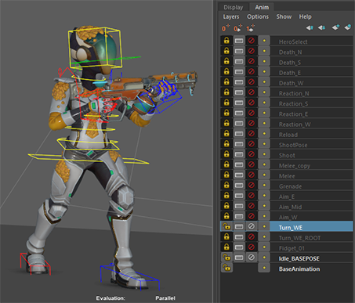

In source animation clips are setup for export and exported to individual files (with the help of a custom export manager). 
Splitting each animation into individual files allows for partial/quick export and import, but requires more work with 
import settings.

> //Assets/Animation/Characters/Terraformer/Clips/Locomotion--Run_N.anim.fbx
> //Assets/Animation/Characters/Terraformer/Clips/Locomotion--Run_S.anim.fbx

### Humanoid and Generic
We use Humanoid for third person and Generic for first person. Using both allows us to demonstrate and exercise 
both pipelines. Humanoid provides re-targeting and built in IK solving, while Generic offers slightly better performance 
and more degrees of freedom in places like fingers.

The use of translation driven squash and stretch (TranslateScale Component) allows for non-uniform scale to be used 
with Generic as well as with Humanoid/Re-targeting.

### Avatars
We aim to define the Avatar for a Skeleton once (well once for Humanoid and Generic) and let any subsequent 
model and animation FBX’s copy this avatar:

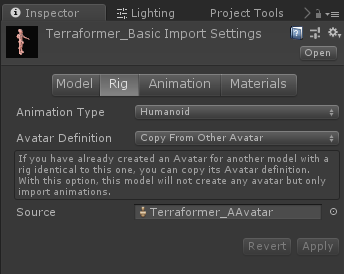

Currently all Avatars copies must be updated if the source Avatar changes. Here is a small script that will accomplish 
that: 

> Menu > FPS Sample > Animation > Update Avatar References

### Avatar Masks
We use Avatar Masks for all our animations for a few reasons:

* Only generate animation curves for relevant bones.
* Generate curves for Generic bones when using Humanoid (these are masked out by default when no mask is used).

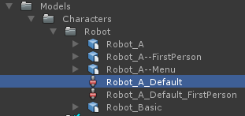

As with Avatars, we assume a default mask will be used for all Clips, unless a special case mask is needed. 
So we use the copy from option:

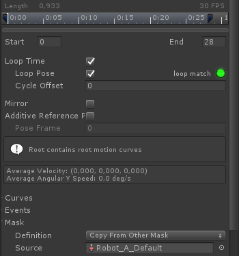

If the source mask changes it must be updated in all dependent clips. Here is a small script that will accomplish that: 

> Menu > FPS Sample > Animation > Update Avatar Masks

### Import AssetPostProcessor
AssetPostProcessor `AnimationImport.cs` does just a few things:

* We have a lot of fast movement in our game, so we over sample Humanoid animations by a factor 2. This will allow the resulting 
Muscle clips to better represent the original motion and we in turn rely on compression to throw away keys that are not needed.
* Force the frame range of any Clip that is present in the FBX, to always match the frame range of the source take (which normally only
happens on first import).   

### Humanoid Configuration
Humanoid has the option of Leg and Arm stretch (Anti pop/Soft IK), which will slight lengthen the bones as they reach 
full extension. This can be especially useful during re-targeting to avoid IK pops, but can have the side effect 
that arm and legs may never fully straighten, when they do in the source animation.

Having almost purely character specific animations in combination with our animation style, turning this feature off made the most sense. 

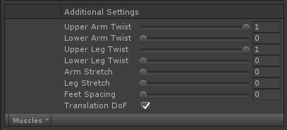

### Iteration
We try to have an iterative workflow where animations are put into game in their earliest/mockup form and continuously 
updated as the projects progresses, bug surface and standards change late in production.

# Animation Implementation

## Third Person Animation

Making network synchronised animation for a server authoritative multi player shooter, puts specific constraints on how we 
implement animation. We need to handle things like replication, rollback, prediction and lag compensation. For this 
reason we have chosen to use a custom Playable Graph for Third Person animation.

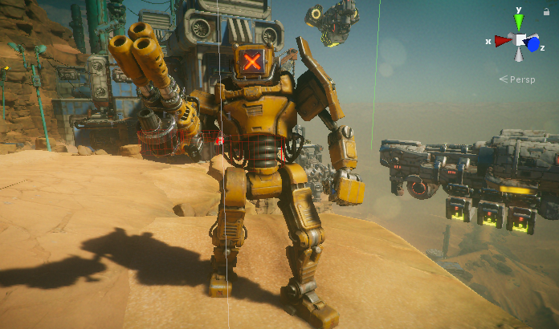

#### Playable Graph
The playable graph is the backend for animation features like TimeLine and the Animator Controller. When you use these 
a playable graph is created in the background. 
Playable graphs can also be constructed and managed through code using the Playable API, which is what we do.

You can view Playable graphs using the Playable Graph Visualizer:

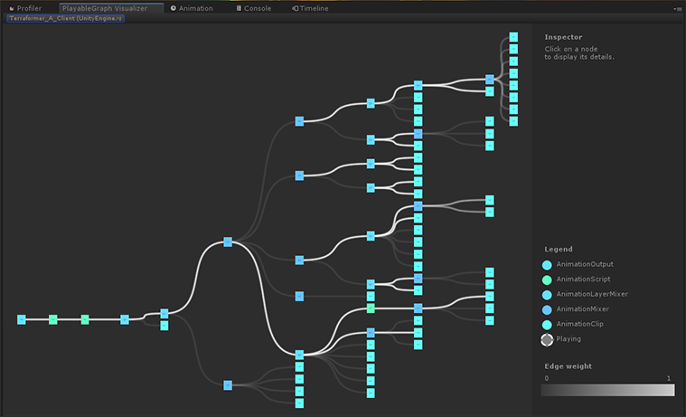

A graph like ours mainly consists of Animation Clips, Animation Mixers and a few Animation Script Playables.

#### Animation Templates
Animation Templates is our way defining pieces of animation network (sub graphs). These are typically hooked together to 
form a larger network.

A Template includes:

* A settings Scriptable Object.
* Code to build out the sub graph and connect it to any parent or child Templates.
* Code that controls the state of the network & reads/writes replicated properties 
(are we turning, how far into the turn are we, phase of the current animation etc.)
* Code that reads the replicated state and applies it to actual playable nodes (mixer weight, clip time, foot ik enabled etc.)

To create an instance of an animation template, right click in the Project window and select:
> Create> FPS Sample >Animation> AnimGraph >Template

Animation Templates for a third person character:

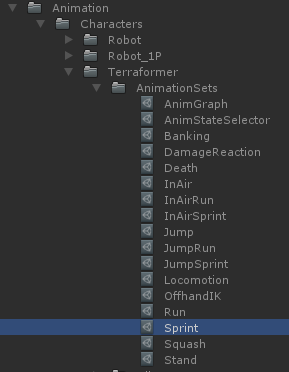

Sprint Template Inspector:

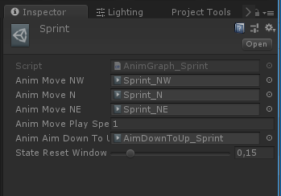

Sub graph created from the Sprint Template, consisting of 4 animation clips, a regular Mixer and a layer mixer:

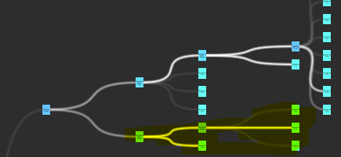

### State Machine: Animation State Selector Template 
A key Template is `AnimGraph_StateSelector`. It acts as a state machine and maps child 
templates/sub graphs to character animation states and blends between them.

> E.G: //Assets/Animation/Characters/Terraformer/AnimationSets/AnimStateSelector.asset

Each state has a default blend in time, with the possibility of defining custom transition times from specific states.

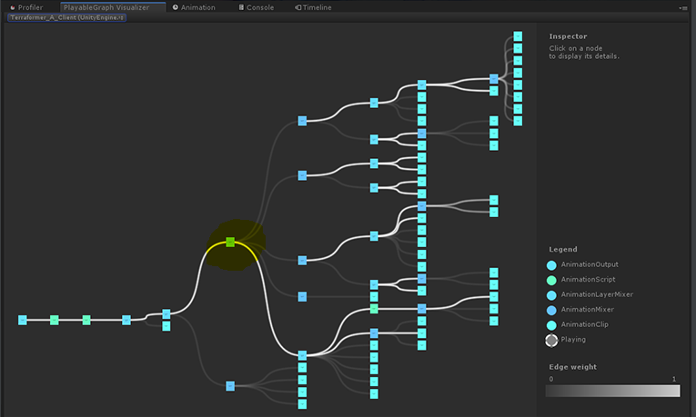

###  Animation Stack
The `AnimGraph_Stack` is currently used as the root Animation Template of our characters graphs. Here we assign 
templates to be chained together in serial fashion.

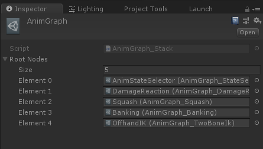

> E.G: //Assets/Animation/Characters/Terraformer/AnimationSets/AnimGraph.asset

### Animation Jobs
Animation Jobs/Animation Script Playables are used for custom nodes that read and write to the animation stream. Examples are:

* Offhand IK (Generic Stream)
* Foot IK while standing (Humanoid Stream)
* First Person Weapon Drag/Lead (Generic Stream)
* Banking (Humanoid Stream)

###  Assigning the Animation Graph to a Character
To assign an Animation Template as a root template for a character, assign it to the `AnimStateController` in the 
Characters Prefab.

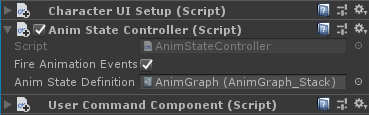

## First Person Animation
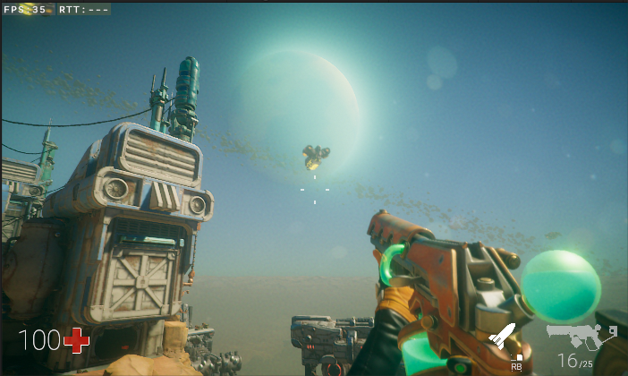

First person is local to the client, which means no multi player constraints, so here we've used the Animator Controller:

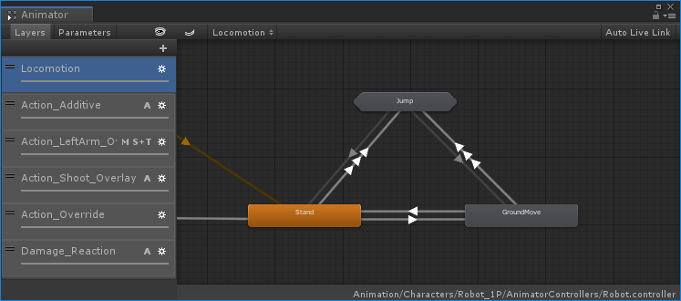

> E.G: //Assets/Animation/Characters/Robot_1P/AnimatorControllers/Robot.controller

Characters and weapon are separate hierarchies, but need to play in sync, so an override controller is used for the weapons:

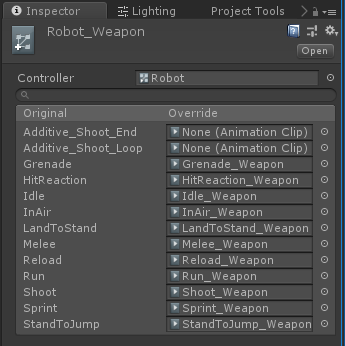

> E.G: //Assets/Animation/Characters/Robot_1P/AnimatorControllers/Robot_Weapon.overrideController

### Setting up the First Person Controller

The Animator Controller is not referenced in the Characters Animator Component, but assigned to an Animator Controller Template 
(`AnimGraph_AnimatorController`). This template wraps the controller in an AnimatorControllerPlayable and forwards game state 
to the Animator Controllers parameters etc. 

> E.G: //Assets/Animation/Characters/Terraformer_1P/AnimationSets/Controller_Character.asset

This is in turn assigned to an Animation Stack Template (`AnimGraph_Stack`) where we add additional nodes, like 
Off Hand IK and Aim Drag.

### Assigning the First Person Controller

The Stack Template is assigned to the `AnimStateController` of the First Person Character Prefab:

