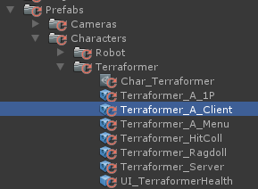
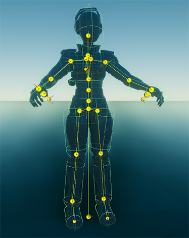
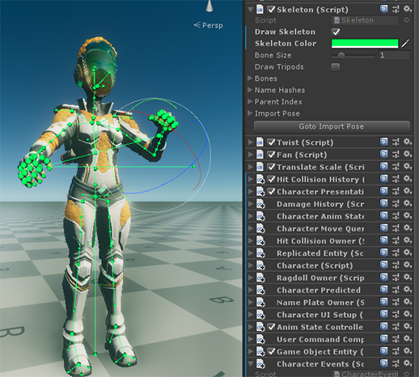
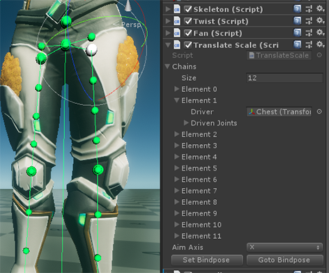
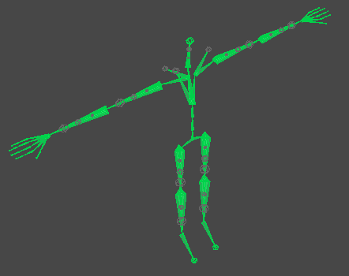

# Character Pipeline

### Iteration
We assume an iterative workflow where characters are put into game in their earliest/mockup phase and continuously 
updated as the projects progresses, bug surface and standards change late in production.

### Authoring
Characters are Modeled and Rigged in Maya and exported into FBX files.

> E.G: //Assets/Models/Characters/Terraformer/Terraformer_A.fbx

### Prefabs
Prefab are where Materials are assigned and additional components for game play systems are added and configured. 
We use Prefab Variants as they allow the prefab to stay up to date as mesh, skeleton and skinning changes throughout production.

There are several prefabs for each character, like first person, client, server, hit collision and ragdoll. A simplified 
version of the characters skeleton is used where appropriate:

### Skeleton Component
The Skeleton Component stores information about the characters bone hierarchy, bone names and default pose for quick 
lookup at runtime. It also lets you visualize and interact with the skeleton in the scene view.

It’s added during import, in order to stay in sync with the model.fbx. Placing skeleton root nodes below a 
transform/group called “Skeleton” (that is a child of the prefab root), should let the skeleton be picked up correctly 
by the AssetPostProcessor `SkeletonImporter.cs.`

### Procedural Bones
Procedural bone components (Twist, Fan and TranslateScale) help with deformations and also allow for Squash and Stretch 
like behaviors. They are added on import, based on markup saved in custom attributes on the skeleton when the rig is 
built in Maya.

Procedural bone setup is stored in MonoBehaviours, which also drive the bones in edit mode (so you can interact with 
the characters skeleton and see the behaviour of the procedural bones). When the game is running they are instead 
driven by systems in LateUpdate using C# jobs and Burst.  For performance reasons procedural bones are not updated on the server.

### Humanoid Configuration
A Stance Pose that is parallel to world coordinates, without bends in in arms and knees is used for best results:

Additional Settings:
* Twist extraction is disabled since we use our own twist solution with dedicated twist bones.
* Translation DoF (Degrees of freedom) is enabled to allow for translation based stretch and other animated translations.

