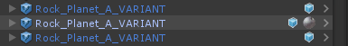
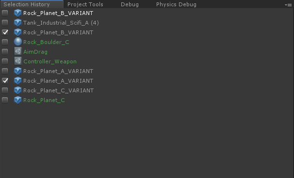
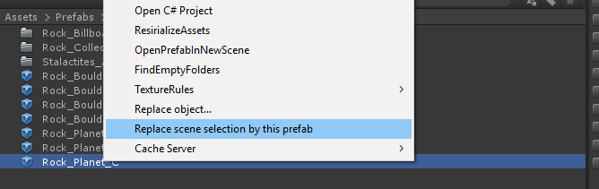
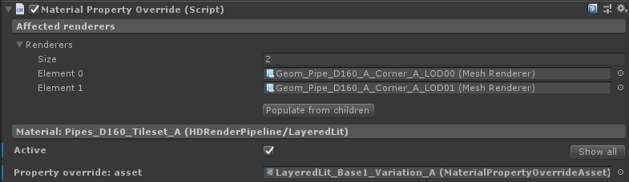
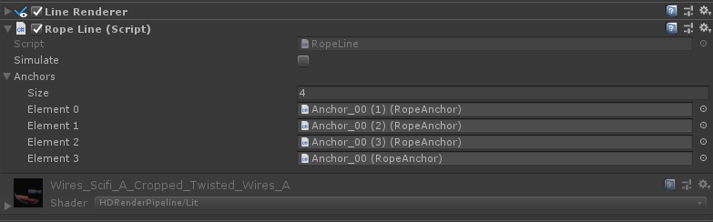
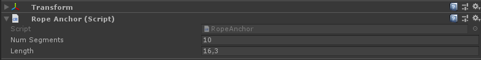
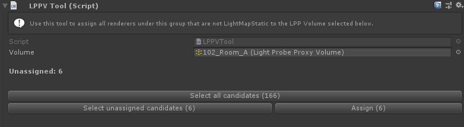
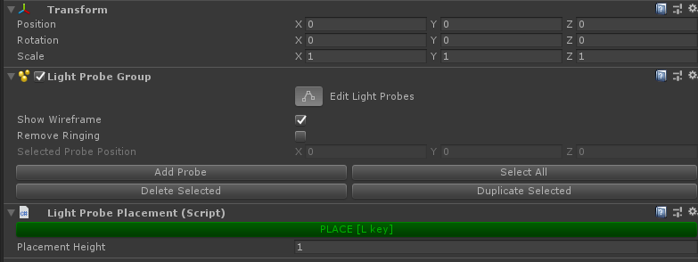
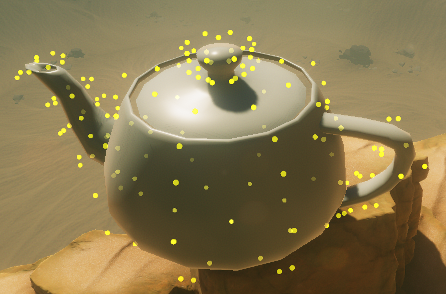
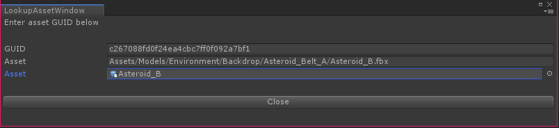

# Small editortools and scripts

The FPS Sample project features a range of little tools, editorscripts, hotkeys and components
that we used creating this project.

This file documents the most commonly used ones, ordered by dicipline.

## Scene editing

__Toggle game view tracking [Hotkey toggle]__\
Syncs position of scene view and default game camera.

> Hotkey: Ctrl+Shift+K\
> Menu: FPS Sample > Hotkeys > Toggle game view tracking

__Cut GameObjects [Hotkey]__\
Cuts the current selection in the scene Hierarchy. The cut objects are marked by a little round icon to the right in the scene Hierarchy

> Hotkey: Ctrl+Shift+X\
> Menu: FPS Sample > Hotkeys > Cut GameObjects

__Paste GameObjects [Hotkey]__\
Paste in previous cut selections in the scene Hierarchy

> Hotkey: Ctrl+Shift+V\
> Menu: FPS Sample > Hotkeys > Paste GameObjects

__Deselect All [Hotkey]__\
Clears the current selection in the scene Hierarchy and Project

> Hotkey: Alt+D\
> Menu: FPS Sample > Hotkeys > Deselect all

__Position under mouse [Hotkey]__\
Positions current selection under the mouse cursor in the scene view on first found collider. Very handy for worldbuilding

> Hotkey: Ctrl+Shift+Q\
> Menu: FPS Sample > Hotkeys > Position under mouse

__Align and position under mouse [Hotkey]__\
Positions and aligns rotation of current selection under the mouse cursor in
the scene view on first found collider

> Hotkey: Ctrl+Shift+Z\
> Menu: FPS Sample > Hotkeys > Align and position under mouse

__Selection History [Dockable window]__\
A dockable window that captures selection history. The checkbox next to history items is
used to 'pin' the item so it doesn't get pushed out by later selected items.
Items in the history window can be dragged onto component fields.
This is useful for setting up assets with many cross references such as materials and complicated prefabs

> Menu: FPS Sample > Windows > Selection History

__Toggle Gizmos [Hotkey toggle]__\
Toggles the visibility of gizmos in the scene view

> Hotkey: Ctrl+G\
> Menu: FPS Sample > Hotkeys > Toggle Gizmos

__LodSelector [Hotkey toggle]__\
A toggle to prevent selection in the scene view of gameobjects that are
referenced in a LOD Component. This helps you avoid mistakes where you select a LOD gameobject
and e.g. move that instead of the prefab it belongs to.

> Hotkey: Alt+L\
> Menu: FPS Sample > Hotkeys > LodSelector

__Replace scene selection by this prefab [Hotkey]__\
Enables you to easily replace scene Hierarchy selection with another resource from Project. Simply make a selection in the 
scene Hierarchy and Ctrl+RMB in Project on what resource you want to replace your selection with and press "Replace scene selection by this prefab"

> Hotkey: Ctrl+RMB

__Take screenshot [Utility]__\
Takes a screenshot using active game view and prompts user where to save screenshot. This script saves out the screenshot in whatever
resolution is chosen in game view regardless of monitor resolution and because of this it can be used to capture high resolution screenshots better than a regular PrintScreen

> Menu: FPS Sample > Take Screenshot

__Fix sceneview fov [Utility]__\
When zooming in the scene view by using the mousewheel the camera clipping
planes are scaled. This script prevents that. Instead the mousewheel will
dolly the camera (i.e. move it forward/backward).

> Menu: FPS Sample > Fix sceneview fov

__Material property override [Component][Asset]__\
The _Material Property Override Component_ allows the user to override material properties based on shader keywords. This is handy as it enables you to tweak ie. the color of a material
or the strength of a normalmap without having to create a new material.

The _Material Property Override Asset_ allows you to push the properties you want to override to a Material Property Override Component from an asset rather than typing it in manually per instance.
This way you can easily push changes to many different materials making it easy to manage ie. color schemes. In the FPS Sample we used Material Property Override Assets
to manage the colors of the pipes, the industrial tanks, the factory exterior detail props and more. By using Material
Property Override Assets we could push the same color values to many different materials making it easy to manage color schemes and keep the number of material resources at a minimum.

__Rope line [Component]__\
These components help setting up ropes using a line renderer. The Rope Line Component keeps track of anchor gameobjects and
draws lines using a line renderer between the ancors. Children of the gameobject that has a Rope Anchor Component will automatically be assigned
to the anchor list if Simulate is ticked. When Simulate is ticked the anchor list is updated and the ropes are simulated. When you
are satisfied with the ropes untick Simulate and the ropes are then saved.

The Rope Anchor Component defines the length and number of segments for that section of the rope. 

## Lighting

__LPPV Tool [Component]__\
This component helps set up and manage light probe proxy volumes. It is a component that references
a given light probe proxy volume and basically checks if it's meshrenderer children are set up to use the same light probe proxy volume
as it refers to. If this is not the case you can set this up by pressing "Assign". This speeds up bulk setup of light probe proxy volumes

__Clear all reflectionprobes to black [Utility]__\
Clears all reflectionprobes to black. This is required to get correct bakes when baking reflectionprobes

> Menu: FPS Sample > Lighting > Reflection Probes > Clear To Black

__Light probe placement [Component]__\
This is a component that can be used for easier placement of lightprobes.
To use this component add it to the gameobject you have your Light Probe Group component.
Enable the script by pressing the toggle key labelled "Place [L key]" and press "Edit Light Probes" in the Light Probe Group Component.
Now a lightprobe will be added whenever you press L. The placement of the probe is pushed in the normal direction of the collision you click on and the height can be altered in the Light Probe Placement component.
It is important that the gameobject on which the component is placed is situated at 0, 0, 0 in worldspace as the probe placement otherwise will be incorrect.

__Light Probe Generator [Asset postprocessor]__\
This is an asset post processor that looks for meshes with the prefix "LPG_" and when found it assigns a Light Probe Group to the object and generates a lightprobe per vertice.

## Other

__Lookup asset guid [Utility]__\
Looks up the GUID for an asset OR looks up the asset for a particular GUID. 

> Hotkey: Ctrl+Alt+L\
> Menu: FPS Sample > Hotkeys > Lookup asset guid

## Animation

__Update Avatar Masks [Utility]__\
Updates all Avatar Masks copies in Clips to their latest source

> Menu: FPS Sample > Animation > Update Animation Masks

__Update Avatar References [Utility]__\
Updates all Avatars copies to their latest source

> Menu: FPS Sample > Animation > Update Avatar References

__Skeleton Pose Interop [Utility]__\
Saves/Loads the transforms of a hierarchy to disk (TMP folder). Based on root selection. 
Mainly intended to interop poses between our Maya Character pipeline and Unity. 

> Menu: FPS Sample > Animation > Skeleton Pose Interop > ..
