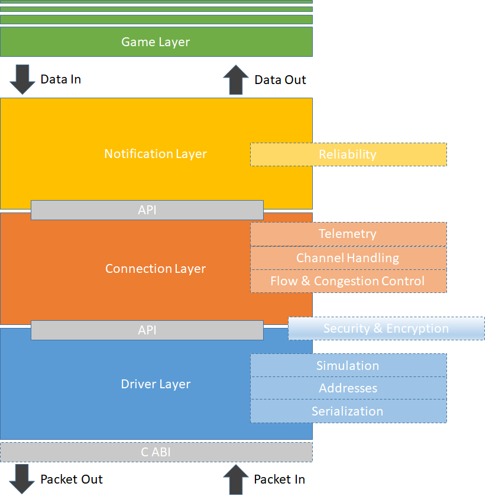

# Welcome to Unity Multiplayer

# About Unity.Multiplayer

Use the com.unity.multiplayer package to add multiplayer / network features for your project.

# Overview

# Installing com.unity.multiplayer

# Technical details
## Requirements

This version of `com.unity.multiplayer` is compatible with the following versions of the Unity Editor:

* 2018.2 and later (recommended)

## Known limitations

Unity.Multiplayer version 0.1.0 has the following limitations:*

* Currently only supports the platforms
  * Windows, Linux, OSX

## Package contents

>>>
This section includes the location of important files you want the user to know about. For example, if this is a sample package containing textures, models, and materials separated by sample group, you may want to provide the folder location of each group.
>>>

The following table indicates the &lt;describe the breakdown you used here&gt;:

|Location|Description|
|---|---|
|`<folder>`|Contains &lt;describe what the folder contains&gt;.|
|`<file>`|Contains &lt;describe what the file represents or implements&gt;.|

## Document revision history

|Date|Reason|
|---|---|
|Jul 18, 2018|Document created. Matches package version 0.1.0.|