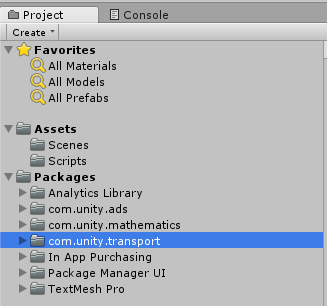
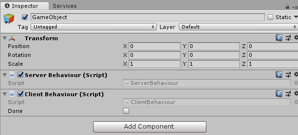
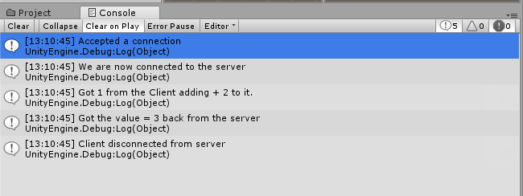
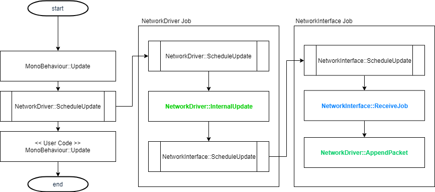
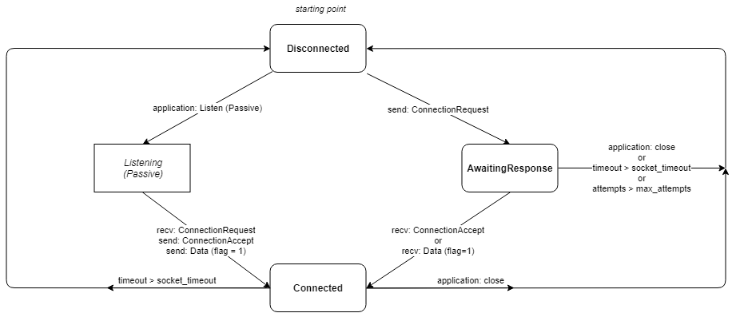

# Table of Content
- [Table of Content](#table-of-content)
- [Foreword](#foreword)
- [Introduction](#introduction)
    - [**1**. Getting Started](#1-getting-started)
        - [**1.1** Installation](#11-installation)
        - [**1.2** Build the `com.unity.transport` package.](#12-build-the-comunitytransport-package)
        - [**1.3** Setup project in Unity](#13-setup-project-in-unity)
    - [**2**. Creating a Minimal Client - Server](#2-creating-a-minimal-client---server)
        - [**2.1**. Creating a Server](#21-creating-a-server)
            - [Boilerplate code.](#boilerplate-code)
            - [ServerBehaviour.cs](#serverbehaviourcs)
            - [The Update Loop](#the-update-loop)
        - [**2.2**. Creating a Client](#22-creating-a-client)
            - [ClientBehaviour.cs](#clientbehaviourcs)
            - [Creating and Connecting a Client.](#creating-and-connecting-a-client)
            - [Updating a Client](#updating-a-client)
        - [**2.3**. Putting it all together.](#23-putting-it-all-together)
    - [**3**. Understanding Update Flow](#3-understanding-update-flow)
        - [Understanding the Connection State Machine](#understanding-the-connection-state-machine)
        - [Event Consuming](#event-consuming)
    - [**4**. Jobyfiying our Example](#4-jobyfiying-our-example)

# Foreword

# Introduction

## **1**. Getting Started

### **1.1** Installation

The first thing we need to-do is to download the [`com.unity.networking`](https:\\github.com\unity\com.unity.networking.git) package.

> Note: Before you continue, make sure you have [`git`](https://git-scm.com/) and `Visual Studio 2017` installed and configured.


So lets open up a terminal and navigate to where we want to have our samples root folder and run the command  
> `$ git clone https:\\github.com\unity\com.unity.networking.git unity.networking`
This makes git clone the repository into a folder called `unity.networking`.

### **1.2** Build the `com.unity.transport` package.

For us to be able to run the project without any hassle we need to build the platform specific binaries. To-do so go into your terminal window agin and navigate into your newly cloned repository, from here you need to go into the `network.bindings` folder and call `build` on windows, ... 

> `$ cd unity.networking\network.bindings`  
> `$ build.bat`

You should see a message indicating that no errors where encountered. If so you are ready to go on to the next phase, setting up a project in unity.

### **1.3** Setup project in Unity

So lets start up the editor and begin by creating a new project. I put the project in the same root folder as the cloned `com.unity.networking` repository. So my root looks like this:

```
client-server/
unity.networking/
```

The first thing we need to-do is to update the manifest file inside the `Packages` folder, so it points to our new downloaded preview package.  

Simply open up the `Packages\manifest.json` file in your favorite editor and add the line:  
`"com.unity.transport": "file:../../unity.networking/com.unity.transport",`  
inside the `{}`, under `"dependencies"`.
```
:.                         
├───client-server           
│   ├───Assets              
│   │   ├───Scenes          
│   │   └───Scripts         
│   ├───Packages            <- We are here.
│   │       manifest.json   
│   │                       
│   └───ProjectSettings     
└───unity.networking        
    ├───com.unity.transport <- We want to point to here.
    └───network.bindings    
```

> Note: Im using a relative path here. `"../../unity.networking"` this means that you should walk 2 steps up in the folderstructre and there should be a folder called `unity.networking`.


> Note: In some cases you might also need to add the line `"com.unity.mathematics": "0.0.12-preview.19",` to your manifest file. And set the `Scripting Runtime Version` to `.NET 4.x Equivalent`, you can find these settings under `Edit->Project Settings->Player->Configuration`

Your file should now look something like this:  

Filename: `manifest.json`
```json
{
  "dependencies": {
    "com.unity.transport": "file:../../unity.networking/com.unity.transport",
    "com.unity.mathematics": "0.0.12-preview.19",
    "com.unity.ads": "2.0.8",
    ...
    "com.unity.modules.xr": "1.0.0"
  }
}
```

Now lets go back to the editor, you should see the editor reloading. When its done reloading you can open up the `Packages` tree inside the `Project` view and find a new package called `com.unity.transport`



Next lets look at a minimal sample using `MonoBehaviours` and the new `unity.networking.transport` package.

## **2**. Creating a Minimal Client - Server

In this chapter we will to create a sample project that shows how to use the `com.unity.networking` api to
- Configure
- Connect
- Send data
- Receive data
- Close a connection
- Disconnect
- Timeout a connection

When we've done this we have technically touched all moving parts of the `transport`. So lets get started, lets make a remote add function. The flow will be a client connects to the server. And sends a number, this number is then received by the server that now adds another number to it and sends it back to the client. The client upon receiving the number disconnects and quits.

Using the `INetworkDriver` to write client and server code is pretty similar, there are a few suttle differences that i will try to bring up here, but if you want to learn more please read the documentation for the [INetworkDriver][3].

### **2.1**. Creating a Server

We will start by creating a server. A server is a endpoint that listens for incomming connection requests and sends and receives messages.

We can start by creating a C# Script in the editor.

Filename: [`Assets\Scripts\ServerBehaviour.cs`][9]
```c#
using System.Collections;
using System.Collections.Generic;
using UnityEngine;

public class ServerBehaviour : MonoBehaviour {

    // Use this for initialization
    void Start () {
        
    }

    // Update is called once per frame
    void Update () {
        
    }
}
```

#### Boilerplate code.

Because the `unity.networking.transport` package is a very low level api there is a bit of boiler plate code you might want to setup. This is a architecture design we chose to make sure that you always have full control. As we continue develop on the `unity.networking` package, more and more abstractions might be created to ease your work on a day to day basis. 

So let's clean up the dependencies and add our boiler plate code.

Filename: [`Assets\Scripts\ServerBehaviour.cs`][9]
```c#
using System.Net;
using UnityEngine;

using Unity.Networking.Transport;
using Unity.Collections;

using NetworkConnection = Unity.Networking.Transport.NetworkConnection;
using UdpCNetworkDriver = Unity.Networking.Transport.BasicNetworkDriver<Unity.Networking.Transport.IPv4UDPSocket>;

...
```

> `using System.Net;`  

We add this dependencies because we want easy access to the `IPEndPoint` and `IPAddress`. The networking package does not use these types internally but it can implicitly convert them to its internal representation for ease of use.

> `using Unity.Networking.Transport;`  
> `using Unity.Collections;`  

Next we then include our package and the new `Unity.Collections` library. We will need `NativeList` for our example on the server to book-keep what active connections we have.

> `using NetworkConnection = Unity.Networking.Transport.NetworkConnection;`  
> `using UdpCNetworkDriver = Unity.Networking.Transport.BasicNetworkDriver<Unity.Networking.Transport.IPv4UDPSocket>;`  

Here we alias some types for less typing. One thing to note is the `BasicNetworkDriver<Unity.Networking.Transport.IPv4UDPSocket>;` alias. The `BasicNetworkDriver<T>` takes a `interface` to a `INetworkInterface`[1]. This type is represents the actual interface the driver should use to establish connections, send and receive data and finally disconnect. We could have opted to use the [`IPCSocket`][2] if we wanted to only use a in process interface.

#### ServerBehaviour.cs

Adding members we need.


Filename: [`Assets\Scripts\ServerBehaviour.cs`][9]
```c#
using ...

public class ServerBehaviour : MonoBehaviour {

    public UdpCNetworkDriver m_Driver;
    private NativeList<NetworkConnection> m_Connections;

    void Start () {
    }
    
    void OnDestroy() {
    }

    void Update () {
    }

```

We need to declare a [`INetworkDriver`][3], in our case we use the [`BasicNetworkDriver`][4]

> `public UdpCNetworkDriver m_Driver;`  
> `private NativeList<NetworkConnection> m_Connections;`  

Here we also create a [`NativeList`](http://native-list-info) to hold our connections.

Filename: [`Assets\Scripts\ServerBehaviour.cs`][9]
```c#
    void Start () {
        m_Driver = new UdpCNetworkDriver(new INetworkParameter[0]);
        if (m_Driver.Bind(new IPEndPoint(IPAddress.Any, 9000)) != 0)
            Debug.Log("Failed to bind to port 9000");
        else
            m_Driver.Listen();

        m_Connections = new NativeList<NetworkConnection>(16, Allocator.Persistent);
    }
```

Next in `m_Driver = new UdpCNetworkDriver(new INetworkParameter[0]);` we just make sure we are creating our driver without any [parameters][5]. Then we try to bind our driver to a specific network address and port. And if that does not fail we call Listen. One very important detail here is that the `Listen` call sets the `NetworkDriver` in the `Listen` state. This means that the `NetworkDriver` will now activly listen for incomming connections. To learn more about the flow inside the network driver and the statemachine please read up on the [`INetworkDriver`][3].

Finally in our setup we create a `NativeList` to hold our connections.

> Note: Both `UdpCNetworkDriver` and `NativeList` allocate unmanaged memory and need to be disposed. To make sure this happens we can simply call the `.Dispose()` method on both of these when we are done.

So let's just add it to the `OnDestroy()` on our `MonoBehaviour`

```c#
    public void OnDestroy()
    {
        m_Driver.Dispose();
        m_Connections.Dispose();
    }

```

#### The Update Loop

Because the `unity.networking.transport` package uses the [JobSystem](https://docs.unity3d.com/Manual/JobSystem.html) internally, the the `m_Driver` has a `SchedueleUpdate` call. So inside our Update loop we need to make sure to call the `Complete` method on the job handle that is returned, in order to know when we are ready to process any updates.

```c#
    void Update () {
        
        m_Driver.ScheduleUpdate().Complete();
```
> Note: In this example, we are forcing a synchonization on the main-thread in order to update and handle our data later in the `MonoBehaviour::Update` call. In Chapter 4. We will show how to use the job system.


So now when we are sure we have updated our `m_Driver` we can start processing. The first thing we want to-do is to handle our connections. We start by first cleaning up any old stale connections from our list before we process any new ones. We do this so we are sure that when we iterate through the list to check what new events we have gotten we dont have any old connections laying around.

Inside the `CleanUpConnections` block we iterate through our connection list and just simply remove any stale connections.

```c#
        // CleanUpConnections
        for (int i = 0; i < m_Connections.Length; i++)
        {
            if (!m_Connections[i].IsCreated)
            {
                m_Connections.RemoveAtSwapBack(i);
                --i;
            }
        }
```

For `AcceptNewConnections` we accept and add a connection while there are new connections to accept.
```c#
        // AcceptNewConnections
        NetworkConnection c;
        while ((c = m_Driver.Accept()) != default(NetworkConnection))
        {
            m_Connections.Add(c);
            Debug.Log("Accepted a connection");
        }
```

So now we have an up to date connection list. We can now start querying the driver for events that might have happened since the last update.

```c#
        DataStreamReader stream;
        for (int i = 0; i < m_Connections.Length; i++)
        {
            if (!m_Connections[i].IsCreated)
                continue;
```
We begin by defining a [`DataStreamReader`][6]. This will be used incase any [`Data`][7] event was received. Then we just start looping through all our connections.

For each connection we want to call `PopEventForConnection` while there are more events still needing to get processed.

```c#
            NetworkEvent.Type cmd;
            while ((cmd = m_Driver.PopEventForConnection(m_Connections[i], out stream)) !=
                NetworkEvent.Type.Empty)
            {
```

Finally we are ready to process events. Lets start with the `Data` event.

```c#
                if (cmd == NetworkEvent.Type.Data)
                {
                    var readerCtx = default(DataStreamReader.Context);
```

Inside this block we start by defining a `readerCtx`, this is a [`DataStreamReader.Context`][6] type. You can see this type as a set of indicies into a `DataStreamReader`, to help with knowing where in the stream we are, and how much we have read.

Next we use our context and try to read a `uint` from the stream and output what we have received.

```c#
                    uint number = stream.ReadUInt(ref readerCtx);
                    Debug.Log("Got " + number + " from the Client adding + 2 to it.");
```

When this is done we simply add 2 to the number we received. And send it back. To send anything with the `INetworkDriver` we need a instance of a [`DataStreamWriter`][8]. A `DataStreamWriter` is a new collection that comes with the `unity.networking.transport` package. Its also a type that needs to be disposed. So here we are just using the `using` statement to make sure that we clean up after our selfs.

After we have written our new updated number to our stream we just call the `Send` method on the driver and off it goes.

```c#
                    number +=2;

                    using (var writer = new DataStreamWriter(4, Allocator.Temp))
                    {
                        writer.Write(number);
                        m_Driver.Send(m_Connections[i], writer);
                    }
                }
```

Finally we need to handle the disconnect case. This is pretty straight forward, if we recieve a disconnect message we just reset that connection to a `default(NetworkConnection)` and as you might remember the next time the update loop will run we will clean up after our selfs.

```c#
                else if (cmd == NetworkEvent.Type.Disconnect)
                {
                    Debug.Log("Client disconnected from server");
                    m_Connections[i] = default(NetworkConnection);
                }
            }
        }
    }

```

So thats it. Thats the whole server. Not that much if you look at it. Sure its pretty verbose but have no fear its gonna get better.

And here is the full source code to [`ServerBehaviour.cs`][9].

### **2.2**. Creating a Client

The client code looks pretty similar to the server code at first glance, but there are a few suttle differences. I will talk about the differences and not so much the similarities.

#### ClientBehaviour.cs

We still define a `UdpCNetworkDriver` but instead of having a list of connections we now only have one. I also added a `Done` flag just to be know when we are done or incase we have issues connecting so we can exit out quickly.

Filename: [`Assets\Scripts\ClientBehaviour.cs`][11]
```c#
using ...

public class ClientBehaviour : MonoBehaviour {

    public UdpCNetworkDriver m_Driver;
    public NetworkConnection m_Connection;
    public bool Done;
    
    void Start () { ... }
    public void OnDestroy() { ... }
    void Update() { ... }
}
```

#### Creating and Connecting a Client.

We start off by creating a driver for the client and a address to the server.
```c#
    void Start () {
        m_Driver = new UdpCNetworkDriver(new INetworkParameter[0]);
        m_Connection = default(NetworkConnection);

        var endpoint = new IPEndPoint(IPAddress.Loopback, 9000);
        m_Connection = m_Driver.Connect(endpoint);
    }
```
Then we just call `Connect` on our driver.

Cleaning up this time is a bit easier because we now dont need an `NativeList` to hold our connections so it simply just becomes:

```c#
    public void OnDestroy()
    {
        m_Driver.Dispose();
    }
```

#### Updating a Client

We start of the same way as we did in the server by calling `m_Driver.ScheduleUpdate().Complete();` And we just want to make sure that connection actually worked.

```c#
    void Update()
    {
        m_Driver.ScheduleUpdate().Complete();

        if (!m_Connection.IsCreated)
        {
            if (!Done)
                Debug.Log("Something went wrong during connect");
            return;
        }
```

By now you should recognize this preamble. But if you look closely you can see that we switched out 
the call to `m_Driver.PopEventForConnection` with a call to `m_Connection.PopEvent`. This is technically the same call it just makes it a bit clearer that we are handling a single connection.

```c#
        DataStreamReader stream;
        NetworkEvent.Type cmd;
        while ((cmd = m_Connection.PopEvent(m_Driver, out stream)) != 
            NetworkEvent.Type.Empty)
        {
```

We now encounter a new event we have not seen yet a `NetworkEvent.Type.Connect` event.
This event tells us that we have received a `ConnectionAccept` message and we are now connected to the remote peer. In this case the server that is listening on port `9000` on `IPAddress.Loopback` more commonly known as `127.0.0.1`.

```
            if (cmd == NetworkEvent.Type.Connect)
            {
                Debug.Log("We are now connected to the server");
                
                var value = 1;
                using (var writer = new DataStreamWriter(4, Allocator.Temp))
                {
                    writer.Write(value);
                    m_Connection.Send(m_Driver, writer);
                }
            }
```
So we said that when we establish a connection between the client and the server. We send a number that we want to have added. So we see here the use of the using pattern together with the `DataStreamWriter`, where we set our value to 1, and write it into the stream and finaly we send it out on the wire.

On Data we read our value back that we received from the server and then call `Disconnect`. A good pattern is to always set your `NetworkConnection` to `default(NetworkConnection)` to avoid stale references.

```c#
            else if (cmd == NetworkEvent.Type.Data)
            {
                var readerCtx = default(DataStreamReader.Context);
                uint value = stream.ReadUInt(ref readerCtx);
                Debug.Log("Got the value = " + value + " back from the server");
                Done = true;
                m_Connection.Disconnect(m_Driver);
                m_Connection = default(NetworkConnection);
            }

```
Lastly we just want to make sure we handle the case that a server disconnects us for some reason. To read up more about the connect and disconnect flow, please checkout this [page][10].

```c#

            else if (cmd == NetworkEvent.Type.Disconnect)
            {
                Debug.Log("Client got disconnected from server");
                m_Connection = default(NetworkConnection);
            }
        }
    }
```

The full source code for the `ClientBehaviour.cs` can be found [here][11]


### **2.3**. Putting it all together.

To take this for a test run, we can simply just add a new empty `GameObject` to our scene.

  

Add add both of our behaviours to it.  


Now when we press `Play` we should see 5 log messages show up in your Console window. Similar to this:



## **3**. Understanding Update Flow

As we saw in the last chapter, we call `SchedueleUpdate` on every frame. This is so we can update the state of each connection we have active make sure we read all data that we have received and finally produce events that the user can react to using `PopEvent` and `PopEventForConnection`.

So lets get started.

The Update loop of the driver is really simple, it might look daunting at first glance but if you strip out all of the job system dependencies you will see we only do 3 things here:



1. We start by calling our `InternalUpdate`, this call is where we clean up any stale connections, we clear our buffers and we finally check timeouts on our connections.
2. The second thing in the chain is running the `ReceiveJob` for reading and parsing the data from the socket.
3. Finally for each new message we receive on the socket we call a `AppendPacket` function that parses each packet received and either creates an event for it or discards it.

Thats it, We clean up, we populate and we push new events. 

You could almost view the `NetworkDriver` as a Control System for the State Machine handling 
`NetworkConnection`.

This brings us to the next topic. Understanding the Connection State Machine.

### Understanding the Connection State Machine

Its important to at least understand how transitions occur in the connection statemachine so you make decisions depending on what triggered each state. And to understand the suttle differences depending if you are `Connecting` to another host or if you simply want to Listen for incomming connections. As you can see below the state machine for the `NetworkConnection` is pretty simple.



All connections start in `Disconnected` state.
- Depending what state the `NetworkDriver` is in, the `Listening (Passive)` state might be triggered. This is when the driver acts like a server listening for incomming connections and data requests. And secondly you could try to use the driver to connect to a remove endpoint and then we would invoke another flow of the state machine.

So to give a overview we have 2 standard scenarios. Either you listen for incomming connections or you use and outgoing connection to connect to someone else.

In our previous example we used the ServerBehaviour to `Listen` and the ClientBehaviour to `Connect`.

### Event Consuming

So we have walked through almost the full update loop, its now back to us the users to do something useful with the information the driver has gathered for us.

There are currently 4 types of events supplied by the `NetworkDriver`

```c#
public enum Type
{
    Empty = 0,
    Data,
    Connect,
    Disconnect
}
```

As mentioned, there are a few suttle differences running the driver as a host or client. Mainly when it comes to consumation of events. 

Both your client and you server loop will want to consume the events that are produced by the `NetworkDriver`. And you do so by either calling `PopEvent` on each `NetworkConnection` similar to how we did before.

```c#
DataStreamReader strm;
NetworkEvent.Type cmd;
while ((cmd = m_Connection.PopEvent(driver, out strm)) != NetworkEvent.Type.Empty)
    ; // Handle Event
```

You can try calling the `PopEventForConnection` on the `NetworkDriver` as we did in the ServerBehaviour example:
```c#
DataStreamReader strm;
NetworkEvent.Type cmd;
while ((cmd = m_Driver.PopEventForConnection(m_Connections[i], out strm)) != NetworkEvent.Type.Empty)
    ; // Handle Event
```

And finally to receive a new `NetworkConnection` on the Driver while Listening you can call `Accept`

```c#
NetworkConnection c;
while ((c = m_Driver.Accept()) != default(NetworkConnection))
    ; // Handle Connection Event.
```

There is no real difference between these calls, both calls will do the same thing. Its just how you want to phrase your self when writing the code.

| Event | Description |
|-------|-------------|
| Empty | The `Empty` event signals that there are no more messages in our event queue to handle this frame. |
| Data | The `Data` event signals that we have received data from a connected endpoint. |
| Connect | The `Connect` event signals that a new connection has been established.<br> **Note**: this event is only available if the `NetworkDriver` is **not** in the `Listening` state. |
| Disconnect | The `Disconnect` event is received if;<br> 1. `Disconnect` packet was received (calling `NetworkConnection::Disconnect` will trigger this.)<br> 2. A *socket timeout* occured.<br> 3. Maximum Attempts on the `NetworkConnection` was hit. <br> **Note:** That if you call `Disconnect` on your `NetworkConnection` this will **NOT** trigger an `Disconnect` event on your local `NetworkDriver`.|

Looking at this table we see that there are 2 things that stand out.
- The first thing is that the `Connect` event is only availeble if the `NetworkDriver` is **NOT** `Listening`  
  - In order to receive any `Connect` events on a `NetworkDriver` that is in the `Listening` state we need to call the special function `Accept` just as we did in ***2.1**. Creating a Server*.
- The second thing to notice is that if you call `Disconnect` on a `NetworkConnection` this will not trigger an event inside your own driver.

## **4**. Jobyfiying our Example

---

[1]: inetworkinterface.md
[2]: ipcsocket.md
[3]: inetworkdriver.md
[4]: basicnetworkdriver.md
[5]: networkparameters.md
[6]: datastreamreader.md
[7]: networkevent.md
[8]: datastreamwriter.md
[9]: samples/serverbehaviour.cs.md
[10]: connectdisconnectflow.md
[11]: samples/clientbehaviour.cs.md