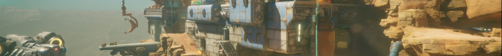
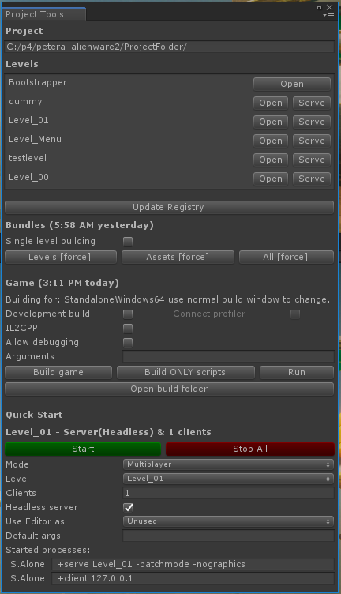

# FPS Sample

Thanks for checking out our project!

This is a fully functional, first person multiplayer shooter game made in
Unity and with full source and assets. It is in active development by a small
team from Unity Technologies. Our goals are to test and showcase new
features in Unity and to be of use for teams who can bootstrap on top of
this, extract useful bits and tools or simply learn from and get inspired by
what is in the project.

Visit our [landing page](https://unity.com/fps-sample) for more high
level information about the project. Or reach out [in the forum](https://forum.unity.com/forums/fps-sample-game.184).

The project is using a number of new technologies: We use the new [HD Render
Pipeline](https://github.com/Unity-Technologies/ScriptableRenderPipeline), meaning 
all content has been authored for HDRP. We are also using the new
[network transport layer](https://github.com/Unity-Technologies/multiplayer) as well as the [Entity-Component System](https://unity3d.com/unity/features/job-system-ECS). 
In the case of ECS, we have primarily adopted the "ECS-pattern" and use it in
hybrid mode with a lot of regular components. As more and more features of
Unity become available in ECS-aware versions, we will migrate to them.

## Status and prerequisites

Current status at a glance:
```
Unity version: 2018.3.8f1
Platforms    : Windows (client and server) and Linux (server only)
```

## Getting the project

To get the project folder you need to clone the project.
Note, that 

> __IMPORTANT__: 
> This project uses Git Large Files Support (LFS). Downloading a zip file using the green button on Github
> **will not work**. You must clone the project with a version of git that has LFS.
> You can download Git LFS here: https://git-lfs.github.com/.

The project size is about 18GB (size of Assets folder). Your cloned repository
will be almost double of that due to git state. If it is much smaller,
you most likely did not have LFS when you cloned.

## Getting the right version of Unity

Once you have cloned the repository, you should install
the version of Unity that is listed above in the prerequisites section. Make
sure you include windows standalone support in your installation (and Linux support
if you want to build the Linux headless server).

## Opening the project for the first time

The following guide should take you to the point where
you can hit play in the editor and run around the levels and also build a
standalone version of the game and use it to spin up a server and connect a
few clients to it.

The first time you open the project you need patience! It takes a while
to import all the assets.

> __NOTE__: Due to a bug in Unity 2018.3, you have to take the following step right after the initial import:
> 1 Search for `Firstperson_Projection` in the Project search field. Select the 4 shaders, right click and reimport them.
> 2 If you have script compile errors related to entities, you need to remove and re-install the entities package.
>
> One day soon we will remove this note and there will be cake.

Once the editor is ready, open the _Project Tools Window_ by
navigating to ___FPS Sample > Windows > Project tools___.

It should look like this:



Keep this window docked as you will use it a lot. From here you can open the
levels, build assetbundles and build standalone players. Because this is a
multiplayer game you will need to work with standalone players a lot.

### Trying out preview mode

From the Project Tools window click __Open__ next to Level_00. Our levels are
split into multiple scenes but using these buttons will ensure you open all the scenes
that make up a level.

Once opened, try entering playmode in the editor. You should now
be able to run around in the level. This is what we call 'preview mode'. Here
you can move around and test your level, player traversal and weapons.

### Building bundles and standalone

Leave playmode again and in the Project Tools window, verify that
it says "Building for: StandaloneWindows64..." under the Game headline.
If it does not, change your platform in the usual way, using File > Build
settings window.

Now, in the Project Tools window in the bundles section, press __All \[force\]__.

This will build the levels and other assets into assetbundles. The first time
around this will take a significant amount of time as all shaders have to be
compiled.

Once you have built the bundles, hit __Build game__ in the game section.
This builds the standalone player. Again, first time will be slow.

> __NOTE__: Due to a limitation in Unity 2018.3, you have to look out for errors like this `Maximum number (256) of shader keywords exceeded, keyword <KEYWORD_NAME> will be ignored.` and similar. If you get these, you can close and open Unity and then try and build again. The errors are relatively harmless but can lead to graphical artifacts as some shaders will have wrong keywords.

### Using the quick start launcher

When this is done, locate the "Quick start" section at the bottom of the
Project Tools window. Fill out the settings like this:

> Mode: __Multiplayer__\
> Level: __Level_00__\
> Clients: __1__\
> Headless: __Checked__\
> Use editor: __Unused__

Now hit the green __Start__ button. This should launch two processes: one is
a standalone, headless server, the other is a client that will attempt to
connect to the server.

Congratulations! If you made it this far you should celebrate a bit!

## Development of FPS Sample, Contributions etc.

As of today, internally development of the project happens on Perforce. We
push versions of the project to github from there. As we do that we will update
the [CHANGELOG](CHANGELOG.md) with highlights but the full history is not
carried over.

For practical reasons we are not able to take larger contributions
just now. But bugfixes are very welcome! Read the guidelines for
contributing in [CONTRIBUTING](CONTRIBUTING.md).

## More information

Check out the [Documentation](Documentation/) folder for more information. In particular, the [Getting Started Guide](Documentation/GettingStarted.md) is a good place to, well, start.

## License

Our intention is that you can use everything in this project as a starting
point or as bits and pieces in your own Unity games. For the legal words, see
[LICENSE.md](LICENSE.md).